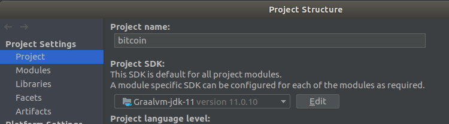
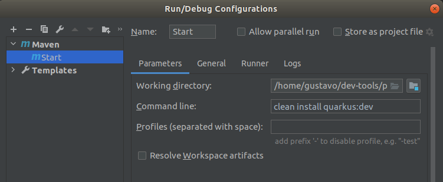
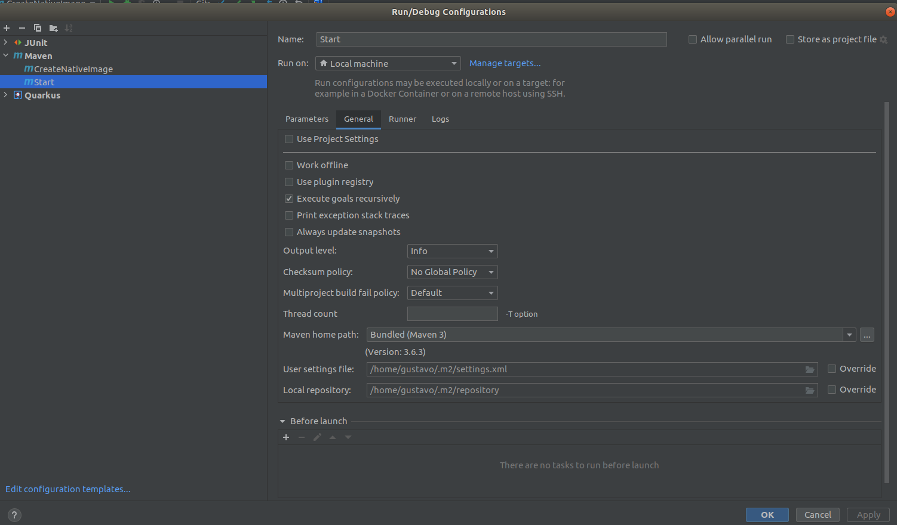
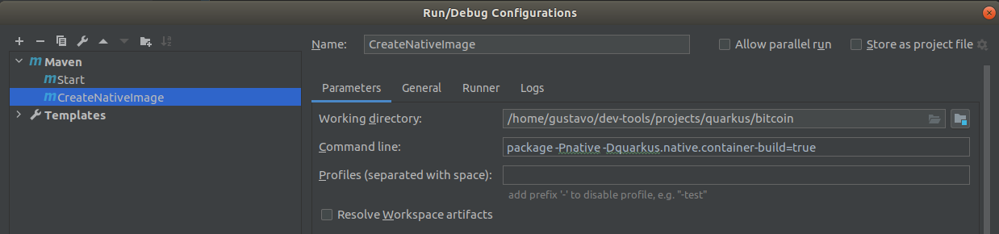
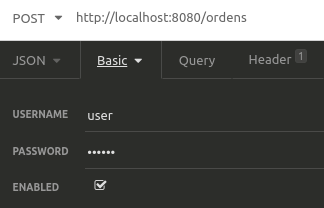
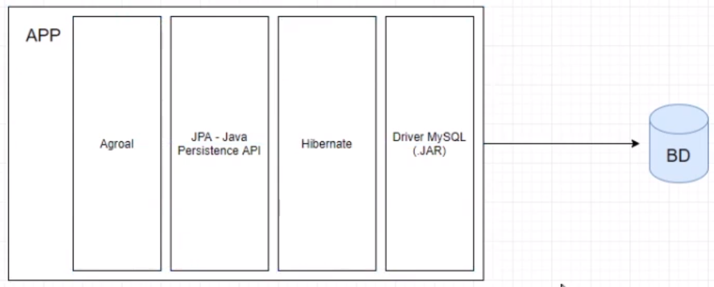

# Quarkus

## Sobre

````
O Quarkus é uma stack que irá utilizar as melhores bibliotecas java e os melhores padrões.
Ele se adapta perfeitamente à Era Cloud. Rápido startup, baixo consumo de memória, entre outros.
Nos oferece uma forma fácil de criar as nossas aplicações, usando o https://code.quarkus.io/
Juntamente com a Graal VM, conseguimos criar a imagem nativa das nossas aplicações, 
o que significa que teremos um executável que será executado em linguagem de máquina, 
com um tamanho extremamente pequeno.

**************************************************************************************************
cd quarkus/bitcoin
mvn clean install quarkus:dev                           <- Start

**************************************************************************************************
Gerando imagem nativa - arquivo menor e start mais rápido
package -Pnative -Dquarkus.native.container-build=true  <- Criar um run maven
./bitcoin-1.0.0-SNAPSHOT-runner                         <- Start Imagem nativa, muito rápido \0/
````








## Tecnologias e metodologias utilizadas

````
Maven
Quarkus
MySQL
Validação de perfil - rules com quarkus-security
ORM
Junit
Mokito
````

## Instalar

````
https://www.graalvm.org/    -> Java 11 - Colocar na pasta e apontar para ela pelo IntelliJ
https://code.quarkus.io     -> Criar o projeto nessa URL

cd graalvm/graalvm-ce-java11-21.0.0.2/bin
./gu install native-image

MySQL no Docker ->
docker run --name mysql8 --network host -e MYSQL_ROOT_PASSWORD=root -d mysql:latest
````



## Dependências

````
<dependency>                        -> Rest
    <groupId>io.quarkus</groupId>
    <artifactId>quarkus-rest-client</artifactId>
</dependency>
<dependency>
    <groupId>org.eclipse.microprofile.rest.client</groupId>
    <artifactId>microprofile-rest-client-api</artifactId>
    <version>1.4.1</version>
</dependency>
<dependency>                        -> JSON
    <groupId>io.quarkus</groupId>
    <artifactId>quarkus-resteasy-jsonb</artifactId>
</dependency>
<dependency>                        -> Testes
    <groupId>io.rest-assured</groupId>
    <artifactId>rest-assured</artifactId>
    <scope>test</scope>
</dependency>
<dependency>                        -> MySQL
    <groupId>io.quarkus</groupId>
    <artifactId>quarkus-jdbc-mysql</artifactId>
</dependency>
<dependency>                        -> ORM
    <groupId>io.quarkus</groupId>
    <artifactId>quarkus-hibernate-orm-panache</artifactId>
</dependency>
<dependency>
    <groupId>io.quarkus</groupId>   -> Validar perfil
    <artifactId>quarkus-security-jpa</artifactId>
</dependency>
<dependency>                        -> Mocar test
    <groupId>io.quarkus</groupId>
    <artifactId>quarkus-panache-mock</artifactId>
</dependency>
<dependency>
    <groupId>io.quarkus</groupId>   -> Mocar test
    <artifactId>quarkus-junit5-mockito</artifactId>
</dependency>
````

## Injeção de dependências - @Inject

````
javax.enterprise.context.ApplicationScoped: 
Uma única instância do bean é criada e compartilhada por todos os pontos de injeção. 
A instância é criada de forma “preguiçosa” (lazily), ou seja, quando um método é invocado através de um client proxy.

Client proxy: 
Um proxy de cliente é basicamente um objeto que delega todas as invocações de método para uma instância de bean de destino. 
É uma construção de container que implementa io.quarkus.arc.ClientProxy e estende a classe de bean. 
Os proxies de cliente apenas delegam invocações de método.

javax.inject.Singleton: 
Mesma ideia do @ApplicationScoped, porém aqui o client proxy não é utilizado, 
a instância é criada quando um ponto de injeção que resolve para um bean @Singleton está sendo injetado.

javax.enterprise.context.RequestScope: 
A instância é associada à requisição, ou seja, uma instância para cada requisição.

javax.enterprise.context.Dependent: 
O ciclo de vida do @Dependent é limitado ao bean que o injeta. 
Ele será criado e destruído com o bean que o injeta.
````

### Créditos Alura

https://cursos.alura.com.br/course/java-supersonico-subatomico-quarkus