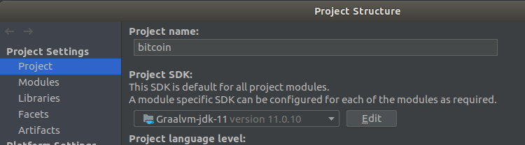
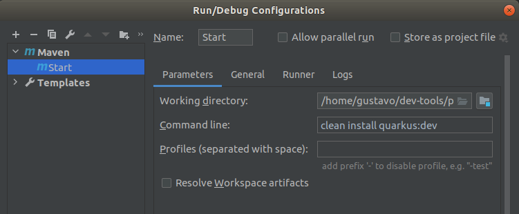
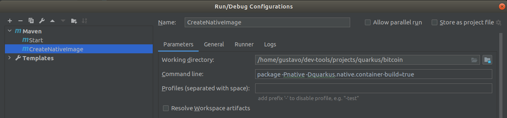
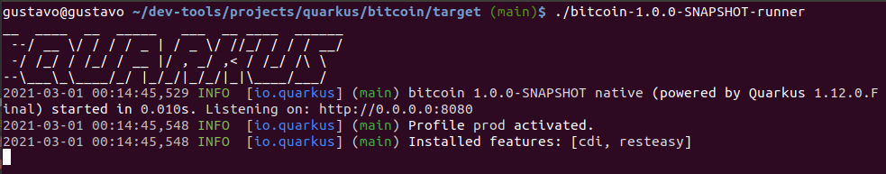

# Quarkus

## Sobre

````
O Quarkus é uma stack que irá utilizar as melhores bibliotecas java e os melhores padrões.
Ele se adapta perfeitamente à Era Cloud. Rápido startup, baixo consumo de memória, entre outros.
Nos oferece uma forma fácil de criar as nossas aplicações, usando o https://code.quarkus.io/
Juntamente com a Graal VM, conseguimos criar a imagem nativa das nossas aplicações, 
o que significa que teremos um executável que será executado em linguagem de máquina, 
com um tamanho extremamente pequeno.

************************************************************************************************************************
cd quarkus/bitcoin
mvn clean install quarkus:dev                           <- Start

************************************************************************************************************************
Gerando imagem nativa - arquivo menor e start mais rápido
package -Pnative -Dquarkus.native.container-build=true  <- Criar um run maven
./bitcoin-1.0.0-SNAPSHOT-runner                         <- Start Imagem nativa, muito rápido \0/
````






## Instalar

````
https://www.graalvm.org/    -> Java 11 - Colocar na pasta e apontar para ela pelo IntelliJ
https://code.quarkus.io     -> Criar o projeto nessa URL

cd graalvm/graalvm-ce-java11-21.0.0.2/bin
./gu install native-image
````

## Dependências

````
<dependency>                    -> Para utilizar Rest
    <groupId>io.quarkus</groupId>
    <artifactId>quarkus-rest-client</artifactId>
</dependency>
<dependency>
    <groupId>org.eclipse.microprofile.rest.client</groupId>
    <artifactId>microprofile-rest-client-api</artifactId>
    <version>1.4.1</version>
</dependency>
<dependency>                    -> Para utilizar JSON
    <groupId>io.quarkus</groupId>
    <artifactId>quarkus-resteasy-jsonb</artifactId>
</dependency>
````

### Créditos Alura

https://cursos.alura.com.br/course/java-supersonico-subatomico-quarkus